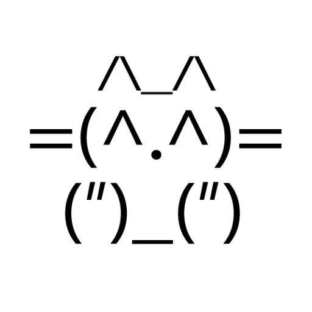
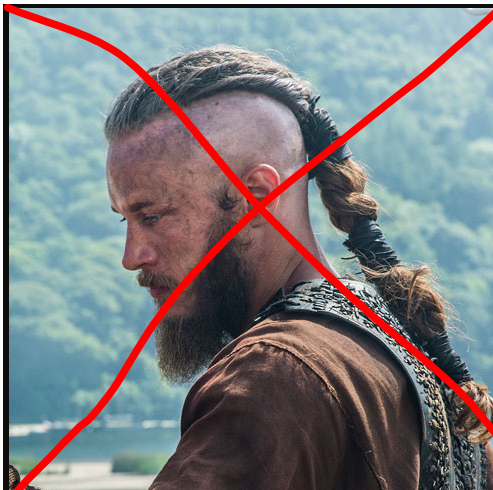

title: Slides
author:
  name: Mykola Denysiuk
  twitter: Quodnon
output: slides.html
controls: true
theme: sudodoki/reveal-cleaver-theme
style: style.css

--

WiFi: Cogniance_UA_guest

Password: welcome2congniance

## 

--

## many thanks to:

--

 

--

--

 

--
# Who we are?

---
# Kottans
Gitter chat: https://gitter.im/Kottans/kottans.github.io

----
## 2012 - ...

----
## Правила
- Будь няшей
- Помогай
- Проси помощи
- Уважай чужое время

--
## Нет мнимому удивлению
Нельзя быть шокированным тем, что кто-то не знает того, что знаете вы.

--

## Да критике
Мы критикуем подходы, код, но не пререходим на личности.

---
# Who are you?

--

## algorithm club 2018

 https://gitter.im/Kottans/algorithm_club

 https://t.me/joinchat/C1v8eg9udVHwnHbha8fYIQ

--

## Why?
--

|Teacher | Ben Affleck |
| -- | -- |
|  |  |

--
### Why?

1. Проходить интервью
1. Проводить интервью

--
### Why?
1. Cоздать/ укрепить фундаментальную базу
1. Oтвязаться от конкретного ЯП
1. Развить воображение

--
### Why?
использовать в работе
- тот же sql
- код без газа
- пример из жизни

--
|Teacher | pvt Pyle |
| -- | -- |
|  |  |

--

# Our goals?

--

### An interview with the star

* Представьтесь, что вы за звезда?
* Что Вы здесь делаете?
* Где(кем) Вы видите себя через 2 года?

--
### Что будем учить:

[Algorithms: Design and Analysis pt1.](https://lagunita.stanford.edu/courses/course-v1:Engineering+Algorithms1+SelfPaced)
*Stanford University*

+
Задачки от авторов: Скиена, Кормак, Дасгупта ...

--

https://github.com/ossu/computer-science

--
### Темы
- Базовые алгоритмы сортировок
- Структуры данных
- Работа с графами
- Алгоритмы построенные на вероятностях

--
## Как будем учить?

- Длительность курса
- Языки программирования

--

## Как будем учить?
- Группы
- Peer review
  - https://random.org

--
## Why we need github?

- Project board to track everybody
- 1 issue = 1 pr = 1 review
- Advice to add screens of your grade progress.

--
## Communication
- Общение приветствуется
- Четверг hangouts с 19-21

--

--
#### Как проводим оффлайн встречи

    120 mins and 90 mins
	
- 20 minutes peer review A-B
- 20 minutes second peer review B-C
- 3-6 pair work presentation * 10 min 30-60 min

--

###	Encourage speakers: 
- Обьяснить теоретическую часть из секции (*)
- Новости
- Интересные случаи

--
## Цель
 
- Добраться до конца курса с не меньшим количеством людей.
- Получить удовольствие

 
--
### Longshot
Часть 2 курса

--
### That is longshot
- More Bridges between people
- More OSS Courses
- Better community

---

# Вопросы
----
# Нам лекции нужны?
 А кого мы на них будем звать?
--

# О чем я забыл?

--

# Home work

-